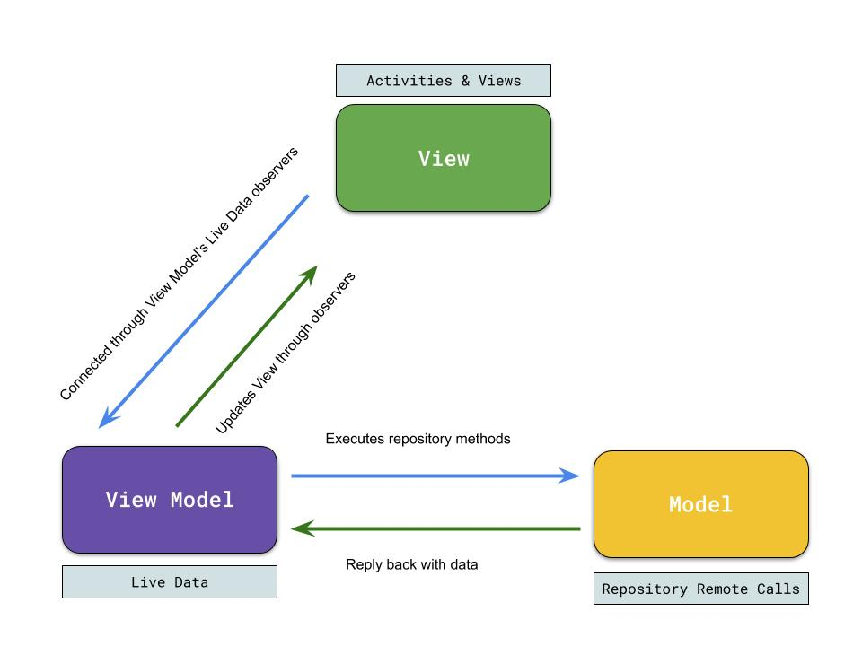
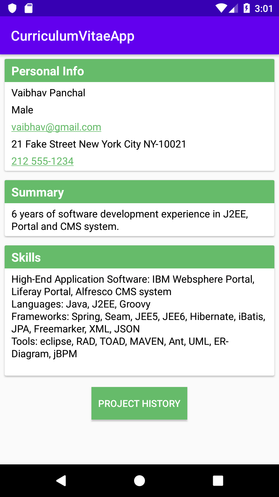
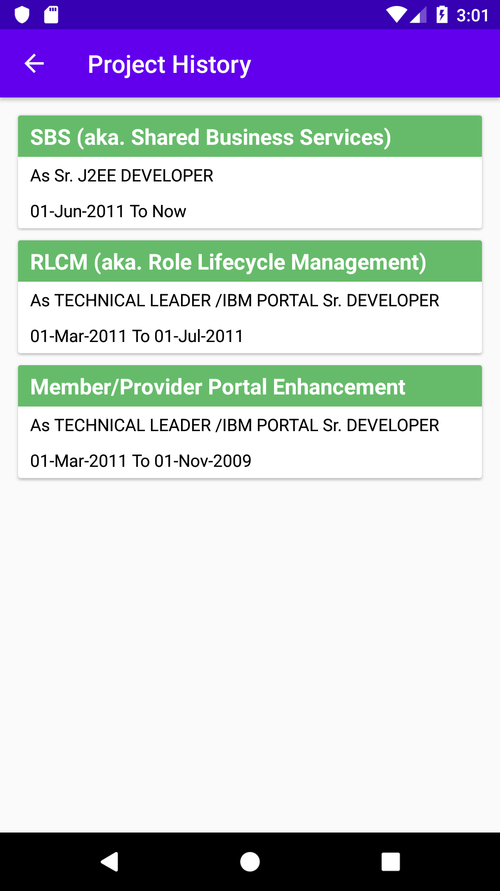

# MyCVApplication
Purpose of this Android application is to show CV fetched from remote server.

# Architecture Diagram

## Screenshots
 

## Why MVVM?
- Simplicity
- Testability
- Extensibility
- Google Android suggested

## Components used
- API Retrofit Library for making network calls
- DI : Dagger 2
- Async Calls : Live Data
- Background call handling : Koltin Coroutine
- Response type form server : JSON
- GSON for parsing JSON
- JUnit for Unit Testing
- Espresso for UI Testing

## Unit Test
- Mocked API responses using Mockito
- Created Mock object using Gson converters
- JUnit for testing ViewModel, Repository and Mapper class

## UI Tests (Espresso)
- UI test case are written using Espresso
- Custom Test Runners to mock API responses and save network calls
